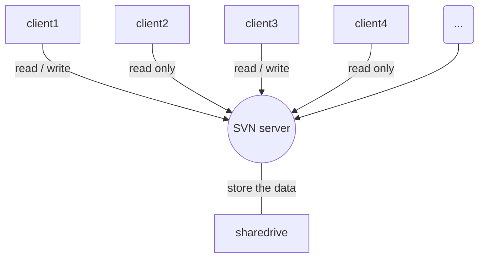

[test](https://github.com/Jason2062/2D-Printer/tree/master/Doxygen/html)

[test](https://github.com/Jason2062/2D-Printer/blob/master/Doxygen/html/annotated.html)

```sequence
Title:连接建立的过程
客户主机->服务器主机: 连接请求（SYN=1,seq=client_isn） 
服务器主机->客户主机: 授予连接（SYN=1,seq=client_isn）\n ack=client_isn+1
客户主机->服务器主机: 确认（SYN=0,seq=client_isn+1）\nack=server_isn+1
```


```
<script src="mermaid.full.min.js"></script>

<div class="mermaid">
graph TD;
    A-->B;
    A-->C;
    B-->D;
    C-->D;
</div>
```
```flow
st=>start: Start|past:>http://www.google.com[blank]
e=>end: End:>http://www.google.com
op1=>operation: My Operation|past
op2=>operation: Stuff|current
sub1=>subroutine: My Subroutine|invalid
cond=>condition: Yes 
or No?|approved:>http://www.baidu.com
c2=>condition: Good idea|rejected
io=>inputoutput: catch something...|request

st->op1(right)->cond
cond(yes, right)->c2
cond(no)->sub1(left)->op1
c2(yes)->io->e
c2(no)->op2->e
```

# test
第一个库
# 标题1
# 标题2
# thrid part
big title
=======
## forth part

-----
* design
* dot
  *dot
     *dot
       * [dot](https://github.com/Arvinszhang/test/blob/master/SG90%20Servo%20Motor%20Datasheet.pdf)
 * [dot](https://components101.com/servo-motor-basics-pinout-datasheet) 
* dot
  * dot
    * dot
      * dot
      
      
      
      <div align=center></div>
   ```
   cellspacing="" 单元外框大小无变化 cellpadding="" 单元格留白无变化 table align="center"无用 table bgcolor="tan"无用 bordercolor="green" 无用
   ```
  > td valign="top"
   >>>>>table
   
  > 这可以让单元格内的表格靠顶
   
   *斜体* **粗体** ***粗斜体***
      
<table bgcolor="tan" bordercolor="green" align="center" border="0" cellspacing="100" cellpadding="10">                                            
 
 <th colspan="4"> header </th>

 <tr bgcolor="red">
  <td bgcolor="green"> palce </td>
  <td> place </td>
 <td> place </td>
 <td> total</td>
 </tr>
 <tr align="center">
  <td> 1 </td>
  <td> 23 </td>
  <td> 234 </td>
 <td rowspan="2"> 516 </td>
  
 </tr>
 <tr>
 <td>1</td>
 <td>23</td>
 <td>234</td>
 </tr>
 </table>
 

  
  
  
 +-------+-------+    +-------+-----+
 |test   |test   |    |test   |test |
 +=======+=======+    +=======+=====+
 |test   |test   |    |test   |test |
 +-------+-------+    +-------+-----+
  
  
 +-------+-------+
 |test   |test   |
 +=======+=======+
 |test   |test   |
 +-------+-------+
  
  
<table width="100%" align="center">
<tr>
<td><table width="100%">
<tr>
<td> </td>
</tr>
</table></td>
<td><table width="100%">
<tr>
<td> </td>
</tr>
</table></td>
</tr>
</table>  
  

  

  
 text
 the content<br> 
 
  ## table
  table| table| table
  ---|---|---
  test|test|test
  
  
table| table|table
---|---|---
1|2|3

 <div style="vertical-align:top; width:600px;">
<table width="50%" style="float:left;">
<tr>
<td>Table1</td>
</tr>
</table>
<table width="50%">
 
 
* dot
test
 <br>
 test
 
> test <br> test
>> test <br> test
>>> test <br> test


<br>


<!DOCTYPE html>
<html>

<head>
<title>表格属性</title>
<meta charset="utf-8">
</head>

<body>
<!-- 在以下表格标签中添加相应代码 -->
<table border="1" width="500" cellspacing="0" cellpadding="5px" align="center">
<caption>课程表</caption>
<tr bgcolor="orange" align="center">
<th>星期一</th>
<th>星期二</th>
<th>星期四</th>
<th>星期五</th>
</tr>
<tr align="center">
<td rowspan ="2">语文</td>
<td>数学</td>
<td>英语</td>
<td>生物</td>
</tr>
<tr align="center">

<td>数学</td>
<td>英语</td>
<td>生物</td>
</tr>
<tr align="center">
<td colspan="4">课间活动</td>
</tr>
<tr align="center">
<td rowspan="2" >
<table border="1"  cellspacing="0" cellpadding="5px" align="center">
<tr>
<td>前半节</td>
<td>后半节</td>
</tr>
<tr>
<td>诗词</td>
<td>古文</td>
</tr>
</table>
</td>
<td>数学</td>
<td>英语</td>
<td>生物</td>
</tr>
<tr align="center">

<td>数学</td>
<td>英语</td>
<td>生物</td>
</tr>
</table>
</body>
</html>
--------------------- 
作者：ShyuDai 
来源：CSDN 
原文：https://blog.csdn.net/qq_39228087/article/details/83047311 
版权声明：本文为博主原创文章，转载请附上博文链接！

~~delate~~
```
table border 边框宽度无变化
```

<table border="1">
 <th>header</th>
 
 <tr>
  <td align="center" colspan="3"><b>Contest</b></td>
 </tr>
  
 <tr>
  <td> palce </td>
  <td> place </td>
 </tr>
 <tr>
  <td> 1 </td>
  <td> 23 </td>
  <td> 234 </td>
  
  
 </tr>

 </table>
 
 
 ···
 记得查甘特图画法
 ···
 
 
 
 graph TD
 mouse_Event()-press->Servo Motor-true->Pen up
 
 graph TD
 mouse_Event()-press->Servo Motor
 mouse_Event()-x move->x cooridinate
 
